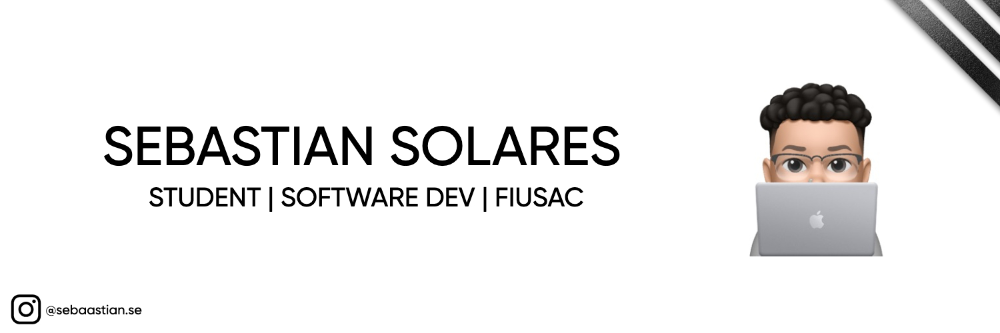

 

  

<h1 align="center">Hi 👋, I'm Sebastian Solares</h1>
<h3 align="center">A passionate developer from GT</h3>

  

  

I am a systems engineering student and enthusiastic developer with a great passion for learning and exploring new technologies. My journey in software development began with curiosity and has grown into a commitment to creating impactful solutions. I thrive in collaborative environments and seek to constantly hone my skills. Here's a little more about me:

- 🌱 I’m currently focused on enhancing my expertise in **Python, Docker, TypeScript, Go, React, Node.js, and AWS Cloud**.

- 💬 I specialize in **JavaScript, Node.js, TypeScript, and Python**. Feel free to reach out with any questions or collaboration opportunities in these areas.

- 📫 You can contact me at **sebastiansolares2001@gmail.com** for inquiries, collaborations, or networking.

<h3 align="left">Connect with me:</h3>

  
  

<h3 align="left">Languages and Tools:</h3>

  
  
  
  
  
  
  
  
  
  
  

  

&nbsp;
  

  

